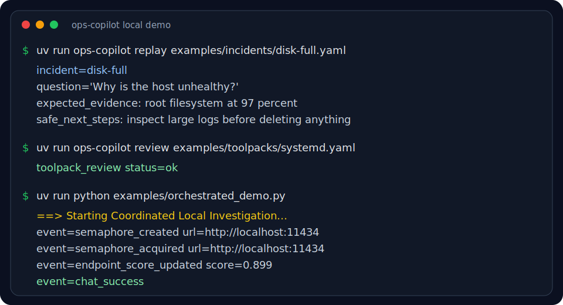

# ops-copilot

[](https://github.com/BenjaminJornet/ops-copilot/actions/workflows/ci.yml)
[](https://pypi.org/project/ops-copilot/)
[](LICENSE)
[](pyproject.toml)

Self-hosted SRE investigation copilot for production systems.

`ops-copilot` lets an LLM call tools defined in YAML, execute safe remote commands over SSH, redact secrets from outputs, and stream investigation events through LangGraph or an optional FastAPI SSE server.

It is built for maintainers who want reviewed operational tools, not arbitrary shell access.

## 30-second demo



From a checkout, run a local incident replay, review a toolpack, and exercise the three-package demo without SSH credentials or API keys:

```bash
uv sync --dev
uv run ops-copilot replay examples/incidents/disk-full.yaml
uv run ops-copilot review examples/toolpacks/systemd.yaml
uv run python examples/orchestrated_demo.py
```

Expected signal:

```text
incident=disk-full
toolpack_review status=ok
Starting Coordinated Local Investigation
```

The orchestrated demo uses `ops-copilot`, `ollama-orchestra`, and `langchain-content-normalizer` together when the three repos are checked out side-by-side.

A recorded asciinema demo is available at `docs/assets/ops-copilot-demo.cast`.

## Who this is for

- SREs and platform engineers running self-hosted infrastructure.
- Open source maintainers operating docs, bots, CI runners, demos, or package services.
- Teams that want reviewed operational tools instead of free-form shell access.
- Developers building incident-investigation UIs around LangGraph or LangChain.

## Maintenance workflows

This repository is maintained with CI, build checks, smoke tests, release workflows, Dependabot, issue templates, PR checklists, a security model, and PyPI releases.

Typical maintainer tasks include reviewing YAML tools, triaging operational edge cases, adding tests for sanitizer and command-rendering behavior, and preparing safe releases.

## What makes it safe

- Tools are reviewed YAML or Python objects, not free-form shell generated by a model.
- String parameters are constrained by `allowed_values`, `pattern`, or a conservative default validator.
- Built-in command policy blocks obvious destructive commands unless the tool explicitly opts in.
- Tool outputs are redacted before they are returned to the model, audit log, or UI.
- `dry_run: true` lets maintainers review rendered commands without executing them.
- JSONL audit logs and incident reports preserve redacted evidence for post-incident review.

## Architecture

```text
User question -> InvestigationGraph -> LLM -> YAML tools -> SSH host
                                      <- redacted tool output <- command result
```

The package is intentionally generic. You can start with shell tools from YAML, then inject custom Python `RemoteTool` classes for richer workflows.

## Install

```bash
uv add ops-copilot
```

Optional extras:

```bash
uv add 'ops-copilot[server]'
uv add 'ops-copilot[openai]'
uv add 'ops-copilot[ollama]'
```

## YAML tools

```yaml
tools:
  - name: disk_usage
    type: shell
    description: Show filesystem usage.
    command: df -h

  - name: journalctl_service
    type: shell
    description: Show recent logs for a systemd service.
    command: journalctl -u {service} --since '{since}' --no-pager
    parameters:
      service:
        type: string
      since:
        type: string
        required: false
        default: "30 minutes ago"
```

## Minimal usage

```python
from ops_copilot import InvestigationGraph, SSHClient, ToolRegistry

ssh = SSHClient(host="server.example.com", user="deploy", key_path="~/.ssh/id_ed25519")
tools = ToolRegistry(ssh, config_path="tools.yaml").load()

graph = InvestigationGraph(
    llm=your_langchain_chat_model,
    tools=tools,
    system_prompt="You are an SRE copilot. Investigate safely and report evidence.",
)

async for event in graph.stream("The API is slow. What should I check?"):
    print(event)
```

## Streaming events

`InvestigationGraph.stream()` yields dictionaries with these event names:

| Event | Meaning |
| --- | --- |
| `token` | streamed model text |
| `tool_start` | tool call started with input and step id |
| `tool_end` | tool call finished with redacted output |
| `error` | graph or stream error |
| `done` | investigation complete |

## Optional FastAPI server

The `ops_copilot.server.create_app()` helper exposes:

- `POST /investigate`
- `POST /investigate/stream`

If `OPS_COPILOT_API_KEY` is set, clients must send `X-API-Key`.

## CLI

```bash
ops-copilot review examples/toolpacks/systemd.yaml
ops-copilot review examples/toolpacks/systemd.yaml --json
ops-copilot replay examples/incidents/disk-full.yaml
```

The CLI is intentionally small: it exposes the maintainer workflows that should run before a toolpack or incident fixture is trusted.

## Security notes

This project executes commands on servers you control. Treat `tools.yaml` as privileged code.

Recommendations:

- Use SSH key auth with least-privilege users.
- Review every command template before exposing it to an LLM.
- Avoid destructive commands in YAML.
- Keep parameterized commands narrow.
- Store no secrets in YAML or prompts.
- Rely on built-in redaction as a safety net, not as your only control.

Built-in redaction covers env-style secret lines, Bearer tokens, OpenAI-style keys, JWTs, long hex runs, and inline image data URLs.

Shell tools also apply a conservative command policy. Obvious destructive commands such as `rm`, `dd`, `mkfs`, `shutdown`, `docker rm`, `docker prune`, and `systemctl restart` are blocked unless the YAML tool explicitly opts in with `policy.allow_destructive: true`. Use `dry_run: true` to review rendered commands without executing them.

## Audit logs

Use `JsonlAuditLog` to append redacted investigation events for incident review:

```python
from ops_copilot import InvestigationGraph, JsonlAuditLog

graph = InvestigationGraph(
    llm=your_langchain_chat_model,
    tools=tools,
    system_prompt="Investigate safely and cite evidence.",
    audit_log=JsonlAuditLog("audit/investigation.jsonl"),
)
```

## Documentation and examples

- `docs/security-model.md` documents threat boundaries and deployment controls.
- `docs/threat-model.md` documents STRIDE-style risks and mitigations.
- `docs/why-ops-copilot.md` explains the project scope and ecosystem need.
- `docs/demo.md` shows a local demo that runs without real SSH credentials.
- `docs/agent-maintenance.md` documents safe AI-assisted maintenance workflows.
- `docs/architecture.md` documents the current data flow.
- `docs/writing-tools.md` explains YAML and custom Python tools.
- `docs/server.md` covers the optional FastAPI/SSE integration.
- `docs/maintenance-workflows.md` describes maintainer workflows and review checklists.
- `docs/toolpacks.md` documents reviewed example toolpacks.
- `docs/incident-fixtures.md` documents fake incidents for demos and regression tests.
- `.github/workflows/ecosystem-smoke.yml` verifies the three-package demo across sibling repos.
- `examples/local_demo.py` runs without a real SSH host using fake outputs.
- `examples/replay_incident.py` replays fake incident fixtures for demos.
- `examples/custom_tool.py` shows how to inject a custom `RemoteTool` class.

## Roadmap

- SQLite-backed investigation sessions.
- More reviewed toolpacks for common self-hosted services.
- More incident fixture coverage for regression tests.
- Coverage and type-checking gates in CI.

## Development

```bash
uv sync --dev
uv run ruff check .
uv run pytest
uv run pytest --cov=ops_copilot --cov-report=term-missing --cov-fail-under=75
uv run python scripts/smoke.py
uv build
```

## License

MIT
